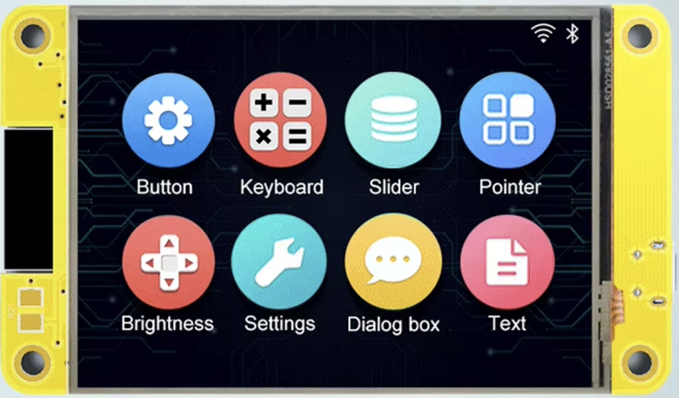

# ESP32-Cheap-Yellow-Display

## Display

- Resolution - 320 x 240 LCD Display (2.8")
- Dimensions - 86 x 50mm

### Docs

- [Pin-Out](PINS.md)

[Credits witnessmenow](https://github.com/witnessmenow/ESP32-Cheap-Yellow-Display)
